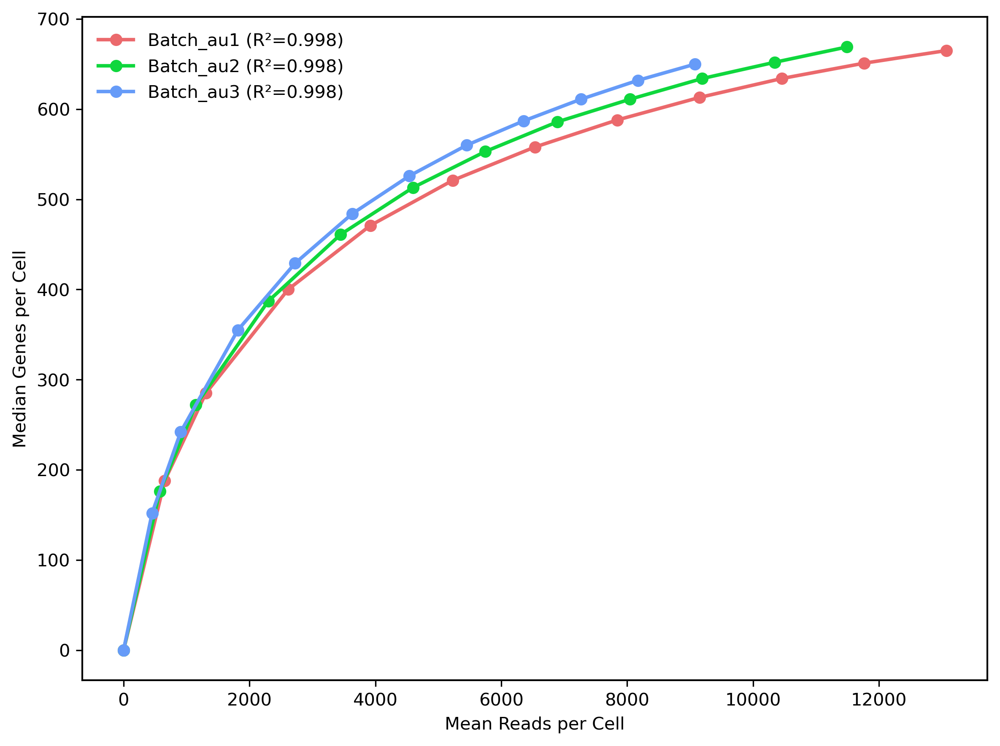
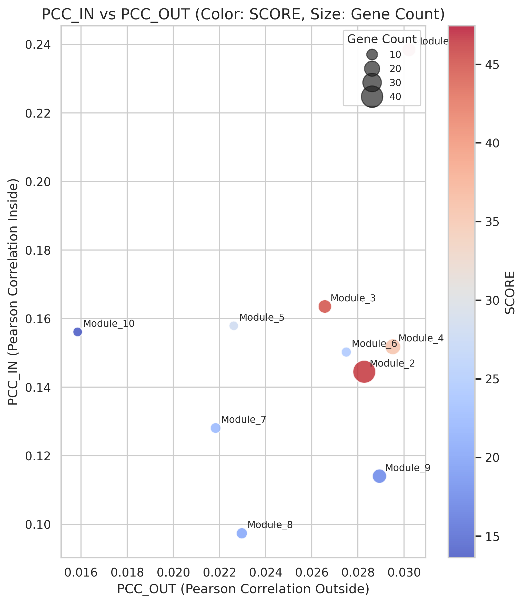

# 测序饱和度与补充统计

[返回结果总览](../README.md)。保留原文件名与全部格式，图号沿用原 Figures 编号（不同于代码编号）。

| 结果名称 | 文件格式 | 当前代码/笔记及证据 |
| --- | --- | --- |
| 01.Curve.genes_VS_reads_with_R2 | [PDF](01.Curve.genes_VS_reads_with_R2.pdf) · [PNG](01.Curve.genes_VS_reads_with_R2.png) | [00.00_plot_figures.ipynb](../../analysis/00_figures/00.00_plot_figures.ipynb)：文件名引用 |
| 81.Scatter.pcc_correlation | [PDF](81.Scatter.pcc_correlation.pdf) · [PNG](81.Scatter.pcc_correlation.png) | [00.00_plot_figures.ipynb](../../analysis/00_figures/00.00_plot_figures.ipynb)：文件名引用 |

## 选图预览

预览使用原图，非重新计算或裁剪；其他格式见上表。

