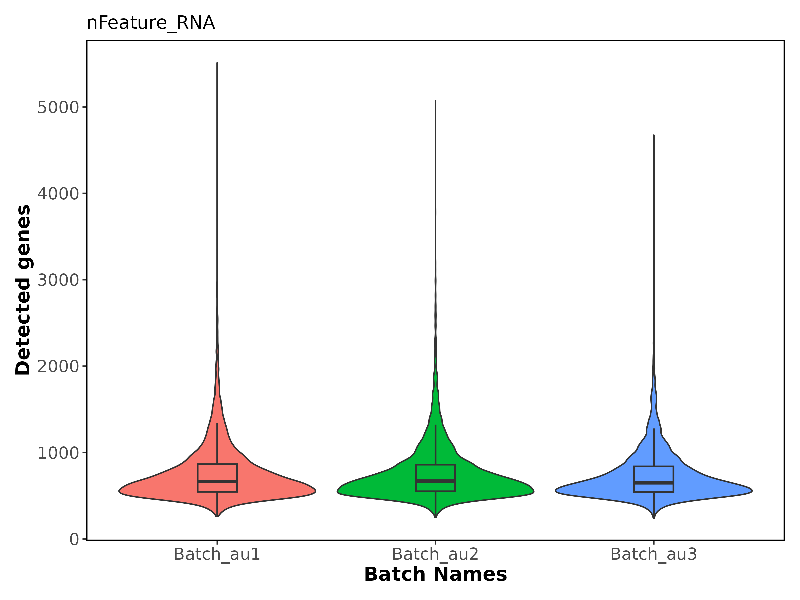
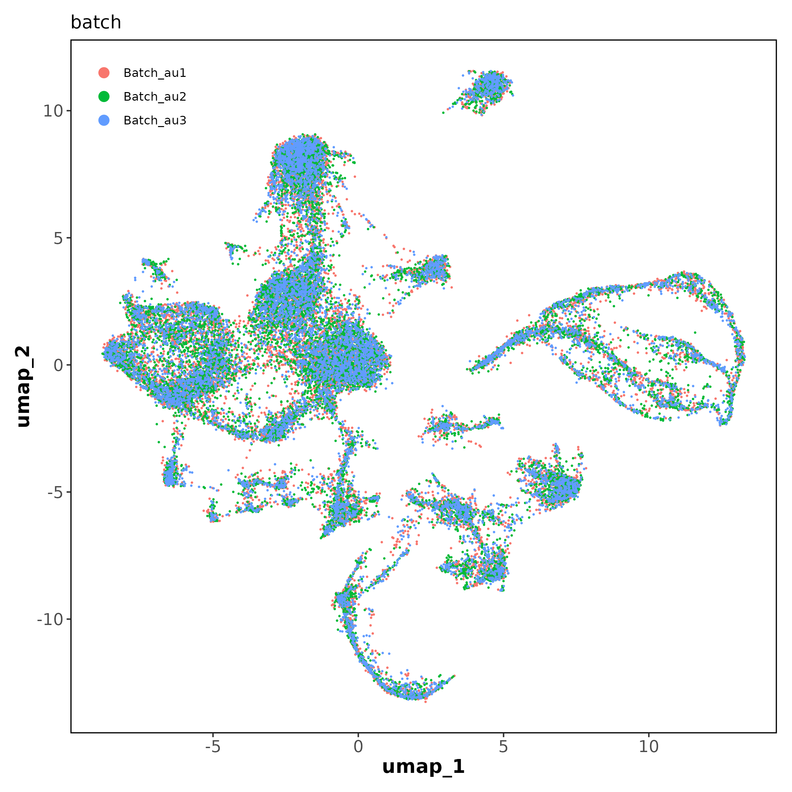
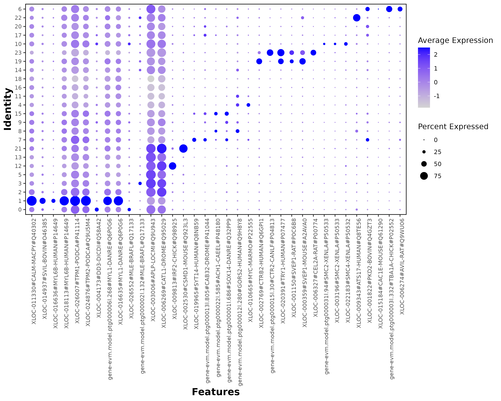

# 单细胞质控、聚类与标记基因

[返回结果总览](../README.md)。保留原文件名与全部格式，图号沿用原 Figures 编号（不同于代码编号）。

| 结果名称 | 文件格式 | 当前代码/笔记及证据 |
| --- | --- | --- |
| 02.VlnPlot.batch_nFeature | [PDF](02.VlnPlot.batch_nFeature.pdf) · [PNG](02.VlnPlot.batch_nFeature.png) | [03.03_Auco_seurat_analysis_R.ipynb](../../analysis/03_single_cell_processing/03.03_Auco_seurat_analysis_R.ipynb)：文件名引用 |
| 03.Histogram.nFeature_RNA_after_qc | [PDF](03.Histogram.nFeature_RNA_after_qc.pdf) · [PNG](03.Histogram.nFeature_RNA_after_qc.png) | [03.03_Auco_seurat_analysis_R.ipynb](../../analysis/03_single_cell_processing/03.03_Auco_seurat_analysis_R.ipynb)：文件名引用 |
| 04.DimPlot.batch_pca | [PDF](04.DimPlot.batch_pca.pdf) · [PNG](04.DimPlot.batch_pca.png) | [03.03_Auco_seurat_analysis_R.ipynb](../../analysis/03_single_cell_processing/03.03_Auco_seurat_analysis_R.ipynb)：文件名引用 |
| 05.ElbowPlot.auco_sc_pcs | [PDF](05.ElbowPlot.auco_sc_pcs.pdf) · [PNG](05.ElbowPlot.auco_sc_pcs.png) | [03.03_Auco_seurat_analysis_R.ipynb](../../analysis/03_single_cell_processing/03.03_Auco_seurat_analysis_R.ipynb)：文件名引用 |
| 06.UMAP.auco_batch | [PDF](06.UMAP.auco_batch.pdf) · [PNG](06.UMAP.auco_batch.png) | [03.03_Auco_seurat_analysis_R.ipynb](../../analysis/03_single_cell_processing/03.03_Auco_seurat_analysis_R.ipynb)：文件名引用 |
| 07.UMAP.auco_clusters | [PDF](07.UMAP.auco_clusters.pdf) · [PNG](07.UMAP.auco_clusters.png) | [03.03_Auco_seurat_analysis_R.ipynb](../../analysis/03_single_cell_processing/03.03_Auco_seurat_analysis_R.ipynb)：文件名引用 |
| 08.TSNE.auco_clusters | [PDF](08.TSNE.auco_clusters.pdf) · [PNG](08.TSNE.auco_clusters.png) | [03.03_Auco_seurat_analysis_R.ipynb](../../analysis/03_single_cell_processing/03.03_Auco_seurat_analysis_R.ipynb)：文件名引用 |
| 09.VlnPlot.XLOC-019965#SYT14-HUMAN#Q8NB59 | [PDF](09.VlnPlot.XLOC-019965%23SYT14-HUMAN%23Q8NB59.pdf) · [PNG](09.VlnPlot.XLOC-019965%23SYT14-HUMAN%23Q8NB59.png) | [03.03_Auco_seurat_analysis_R.ipynb](../../analysis/03_single_cell_processing/03.03_Auco_seurat_analysis_R.ipynb)：动态文件名/去编号对应 |
| 10.UMAP.FeaturePlot.XLOC-019965#SYT14-HUMAN#Q8NB59 | [PDF](10.UMAP.FeaturePlot.XLOC-019965%23SYT14-HUMAN%23Q8NB59.pdf) · [PNG](10.UMAP.FeaturePlot.XLOC-019965%23SYT14-HUMAN%23Q8NB59.png) | [03.03_Auco_seurat_analysis_R.ipynb](../../analysis/03_single_cell_processing/03.03_Auco_seurat_analysis_R.ipynb)：动态文件名/去编号对应 |
| 11.Dendrogram.auco_cluster | [PDF](11.Dendrogram.auco_cluster.pdf) · [PNG](11.Dendrogram.auco_cluster.png) | [03.03_Auco_seurat_analysis_R.ipynb](../../analysis/03_single_cell_processing/03.03_Auco_seurat_analysis_R.ipynb)：文件名引用 |
| 11.DotPlot.filtered_DEGs | [PDF](11.DotPlot.filtered_DEGs.pdf) · [PNG](11.DotPlot.filtered_DEGs.png) | [03.03_Auco_seurat_analysis_R.ipynb](../../analysis/03_single_cell_processing/03.03_Auco_seurat_analysis_R.ipynb)：文件名引用 |
| 12.DotPlot.markers | [PDF](12.DotPlot.markers.pdf) · [PNG](12.DotPlot.markers.png) | [03.03_Auco_seurat_analysis_R.ipynb](../../analysis/03_single_cell_processing/03.03_Auco_seurat_analysis_R.ipynb)：文件名引用 |

## 选图预览

预览使用原图，非重新计算或裁剪；其他格式见上表。

