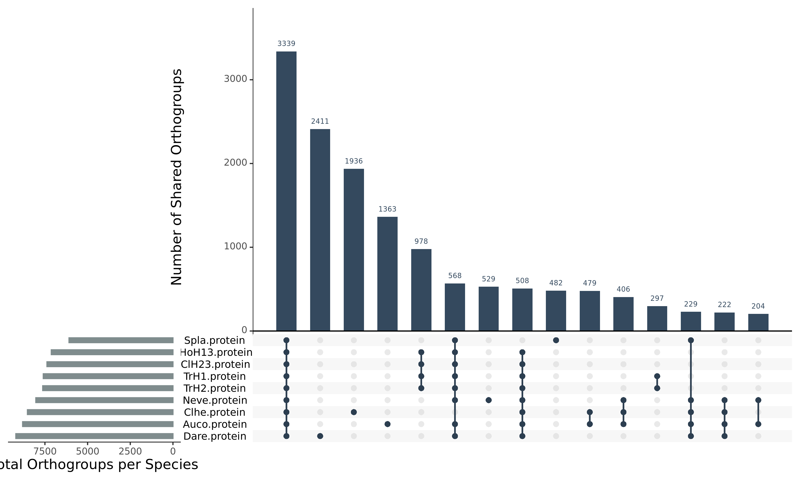
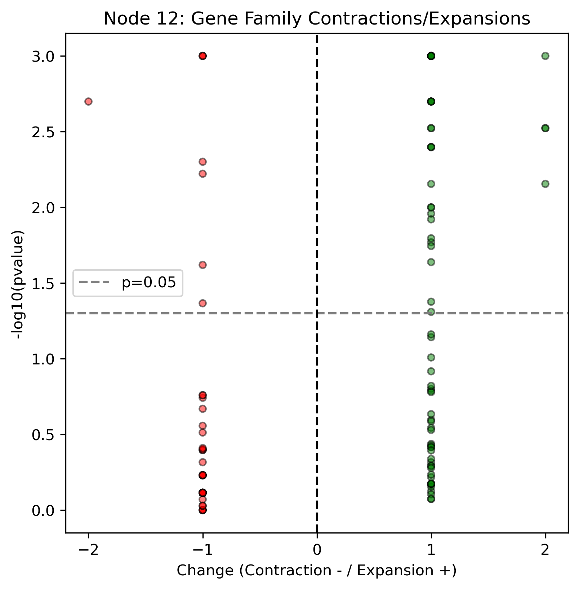
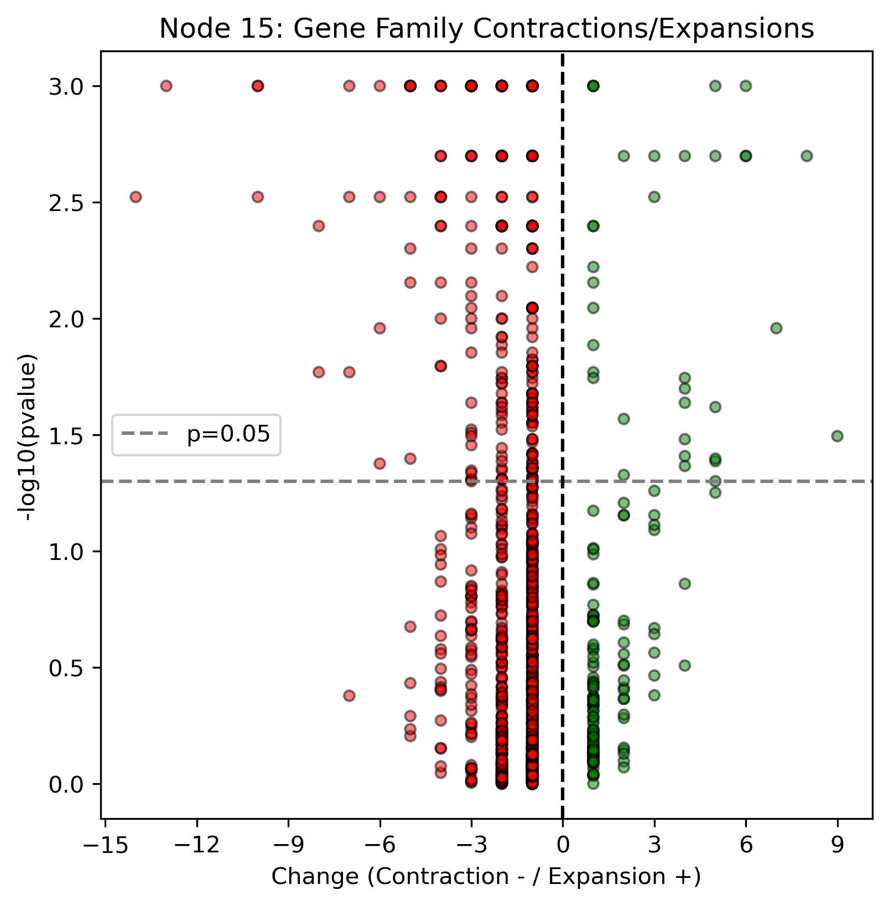

# 基因家族演化与节点富集

[返回结果总览](../README.md)。保留原文件名与全部格式，图号沿用原 Figures 编号（不同于代码编号）。

| 结果名称 | 文件格式 | 当前代码/笔记及证据 |
| --- | --- | --- |
| 58.Echart_pie.CAFE | [HTML](58.Echart_pie.CAFE.html) · [SVG](58.Echart_pie.CAFE.svg) | [05.04_CAFE5_analysis.sh](../../analysis/05_genome_analysis/05.04_CAFE5_analysis.sh)：主题关联，生成关系未核实 [05.05_CAFE5_specific_analysis.sh](../../analysis/05_genome_analysis/05.05_CAFE5_specific_analysis.sh)：主题关联，生成关系未核实 [58.Echart_pie.CAFE.txt](../../visualization/echarts_notes/58.Echart_pie.CAFE.txt)：手工绘图笔记 |
| 59.UpSetPlot_Orthogroups | [PDF](59.UpSetPlot_Orthogroups.pdf) · [PNG](59.UpSetPlot_Orthogroups.png) | [05.03_OrthoFinder_results_plot_R.ipynb](../../analysis/05_genome_analysis/05.03_OrthoFinder_results_plot_R.ipynb)：文件名引用 [05.03_OrthoFinder_results_processing_Python.ipynb](../../analysis/05_genome_analysis/05.03_OrthoFinder_results_processing_Python.ipynb)：主题关联，生成关系未核实 |
| 60.Echart_BarRadial.OrthoFinder_per_species | [HTML](60.Echart_BarRadial.OrthoFinder_per_species.html) · [SVG](60.Echart_BarRadial.OrthoFinder_per_species.svg) | [05.03_OrthoFinder_results_processing_Python.ipynb](../../analysis/05_genome_analysis/05.03_OrthoFinder_results_processing_Python.ipynb)：主题关联，生成关系未核实 [05.03_OrthoFinder_results_plot_R.ipynb](../../analysis/05_genome_analysis/05.03_OrthoFinder_results_plot_R.ipynb)：主题关联，生成关系未核实 [60.Echart_BarRadial.OrthoFinder_per_species.txt](../../visualization/echarts_notes/60.Echart_BarRadial.OrthoFinder_per_species.txt)：手工绘图笔记 |
| 61.Echart_pie.OrthoFinder_all | [HTML](61.Echart_pie.OrthoFinder_all.html) · [SVG](61.Echart_pie.OrthoFinder_all.svg) | [05.03_OrthoFinder_results_processing_Python.ipynb](../../analysis/05_genome_analysis/05.03_OrthoFinder_results_processing_Python.ipynb)：主题关联，生成关系未核实 [05.03_OrthoFinder_results_plot_R.ipynb](../../analysis/05_genome_analysis/05.03_OrthoFinder_results_plot_R.ipynb)：主题关联，生成关系未核实 [61.Echart_pie.OrthoFinder_all.txt](../../visualization/echarts_notes/61.Echart_pie.OrthoFinder_all.txt)：手工绘图笔记 |
| 62.DotPlot.node11_enrichment_GO | [PDF](62.DotPlot.node11_enrichment_GO.pdf) | [05.11_CAFE5_node11_Enrich_R.ipynb](../../analysis/05_genome_analysis/05.11_CAFE5_node11_Enrich_R.ipynb)：主题关联，生成关系未核实 |
| 62.DotPlot.node12_enrichment_GO | [PDF](62.DotPlot.node12_enrichment_GO.pdf) | [05.11_CAFE5_node12_Enrich_R.ipynb](../../analysis/05_genome_analysis/05.11_CAFE5_node12_Enrich_R.ipynb)：主题关联，生成关系未核实 |
| 62.DotPlot.node15_enrichment_GO | [PDF](62.DotPlot.node15_enrichment_GO.pdf) | [05.11_CAFE5_node15_Enrich_R.ipynb](../../analysis/05_genome_analysis/05.11_CAFE5_node15_Enrich_R.ipynb)：主题关联，生成关系未核实 |
| 62.DotPlot.nodeCommon_12_15_enrichment_GO | [PDF](62.DotPlot.nodeCommon_12_15_enrichment_GO.pdf) | [05.11_CAFE5_nodeCommon_12_15_Enrich_R.ipynb](../../analysis/05_genome_analysis/05.11_CAFE5_nodeCommon_12_15_Enrich_R.ipynb)：主题关联，生成关系未核实 |
| 63.jVenn.node_Common_12_15_all_OGs | [SVG](63.jVenn.node_Common_12_15_all_OGs.svg) | [05.04_CAFE5_analysis.sh](../../analysis/05_genome_analysis/05.04_CAFE5_analysis.sh)：主题关联，生成关系未核实 [05.05_CAFE5_specific_analysis.sh](../../analysis/05_genome_analysis/05.05_CAFE5_specific_analysis.sh)：主题关联，生成关系未核实 |
| 63.jVenn.node_Common_12_15_significant_intersect_OGs | [SVG](63.jVenn.node_Common_12_15_significant_intersect_OGs.svg) | [05.04_CAFE5_analysis.sh](../../analysis/05_genome_analysis/05.04_CAFE5_analysis.sh)：主题关联，生成关系未核实 [05.05_CAFE5_specific_analysis.sh](../../analysis/05_genome_analysis/05.05_CAFE5_specific_analysis.sh)：主题关联，生成关系未核实 |
| 64.Scatter.node12 | [PDF](64.Scatter.node12.pdf) · [PNG](64.Scatter.node12.png) | [05.12_Phylogenetic_analysis_Python.ipynb](../../analysis/05_genome_analysis/05.12_Phylogenetic_analysis_Python.ipynb)：文件名引用 |
| 64.Scatter.node15 | [PDF](64.Scatter.node15.pdf) · [PNG](64.Scatter.node15.png) | [05.12_Phylogenetic_analysis_Python.ipynb](../../analysis/05_genome_analysis/05.12_Phylogenetic_analysis_Python.ipynb)：文件名引用 |

## 使用说明

Figures 文件有加编号、改名或动态文件名；关联代码可能写往 Data。未验证与 Data 中导出文件的字节相等。

## 选图预览

预览使用原图，非重新计算或裁剪；其他格式见上表。

