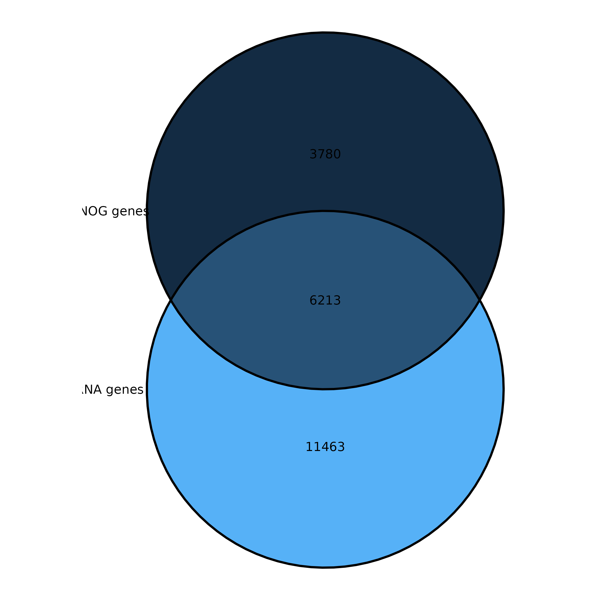
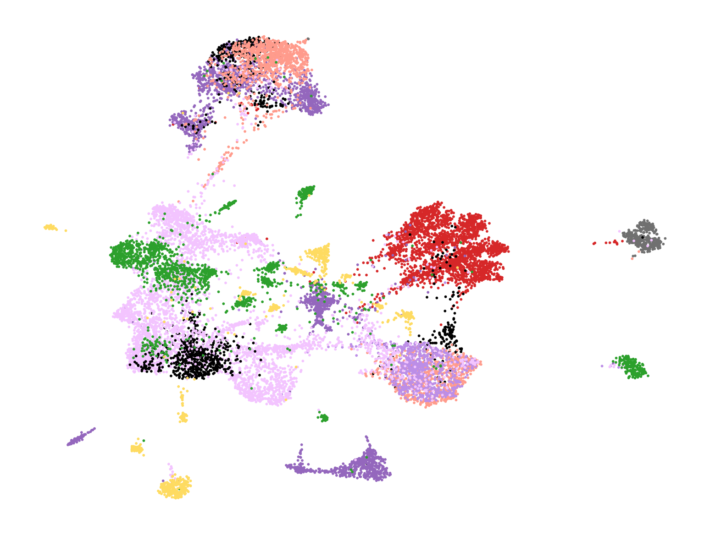
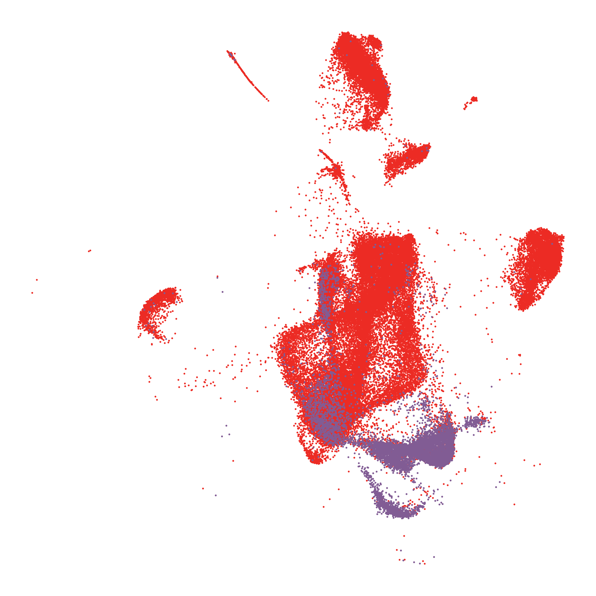
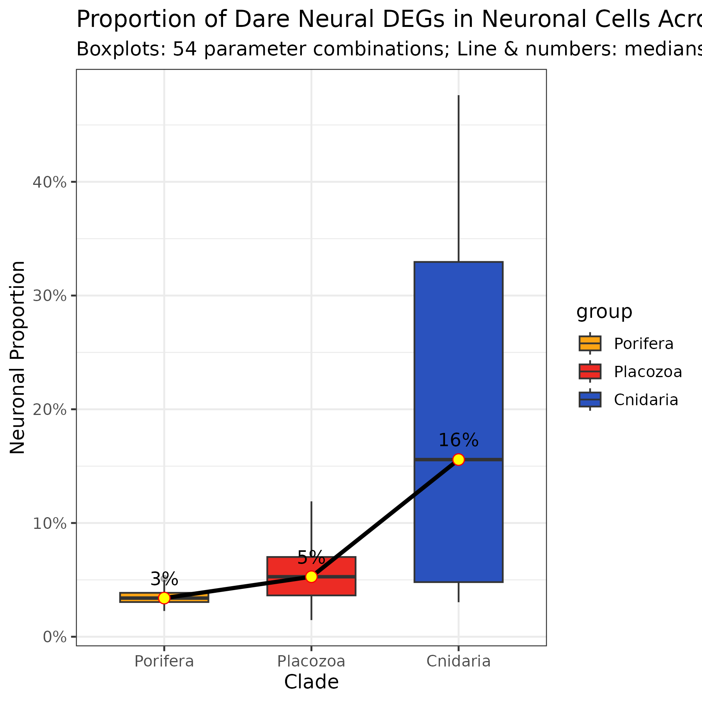

# 细胞注释、跨物种图谱与神经功能

[返回结果总览](../README.md)。保留原文件名与全部格式，图号沿用原 Figures 编号（不同于代码编号）。

| 结果名称 | 文件格式 | 当前代码/笔记及证据 |
| --- | --- | --- |
| 13.Venn.seurat_vs_eggNOG | [PDF](13.Venn.seurat_vs_eggNOG.pdf) · [PNG](13.Venn.seurat_vs_eggNOG.png) | [06.01_Auco_DEGs_GOs_analysis_R.ipynb](../../analysis/06_single_cell_analysis/06.01_Auco_DEGs_GOs_analysis_R.ipynb)：文件名引用 |
| 14.DotPlot.cluster7_GSEA | [PDF](14.DotPlot.cluster7_GSEA.pdf) | [06.01_Auco_DEGs_GOs_analysis_R.ipynb](../../analysis/06_single_cell_analysis/06.01_Auco_DEGs_GOs_analysis_R.ipynb)：动态文件名/去编号对应 |
| 15.Echarts_sunburst.clusters_GSEA | [HTML](15.Echarts_sunburst.clusters_GSEA.html) · [SVG](15.Echarts_sunburst.clusters_GSEA.svg) | [06.01_Auco_DEGs_GOs_analysis_R.ipynb](../../analysis/06_single_cell_analysis/06.01_Auco_DEGs_GOs_analysis_R.ipynb)：主题关联，生成关系未核实 [15.Echarts_sunburst.clusters_GSEA.txt](../../visualization/echarts_notes/15.Echarts_sunburst.clusters_GSEA.txt)：手工绘图笔记 |
| 16.Curve.GSEA_GO_0022843 | [PDF](16.Curve.GSEA_GO_0022843.pdf) | [06.01_Auco_DEGs_GOs_analysis_R.ipynb](../../analysis/06_single_cell_analysis/06.01_Auco_DEGs_GOs_analysis_R.ipynb)：文件名引用 |
| 18.UMAP.auco_annotated | [PNG](18.UMAP.auco_annotated.png) | [06.04_Auco_Annotation_Python.ipynb](../../analysis/06_single_cell_analysis/06.04_Auco_Annotation_Python.ipynb)：文件名引用 |
| 19.DotPlot.Sub_cell_type | [PDF](19.DotPlot.Sub_cell_type.pdf) | [06.04_Auco_Annotation_Python.ipynb](../../analysis/06_single_cell_analysis/06.04_Auco_Annotation_Python.ipynb)：文件名引用 |
| 20.DotPlot.Braod_cell_type | [PDF](20.DotPlot.Braod_cell_type.pdf) | [06.04_Auco_Annotation_Python.ipynb](../../analysis/06_single_cell_analysis/06.04_Auco_Annotation_Python.ipynb)：文件名引用 |
| 21.Echarts_bar.sub_cell_type | [HTML](21.Echarts_bar.sub_cell_type.html) · [SVG](21.Echarts_bar.sub_cell_type.svg) | [06.04_Auco_Annotation_Python.ipynb](../../analysis/06_single_cell_analysis/06.04_Auco_Annotation_Python.ipynb)：主题关联，生成关系未核实 [21.Echarts_bar.sub_cell_type.txt](../../visualization/echarts_notes/21.Echarts_bar.sub_cell_type.txt)：手工绘图笔记 |
| 22.Echarts_scatter_auco_UMAP | [HTML](22.Echarts_scatter_auco_UMAP.html) | [06.04_Auco_Annotation_Python.ipynb](../../analysis/06_single_cell_analysis/06.04_Auco_Annotation_Python.ipynb)：文件名引用 [22.Echarts_scatter_auco_UMAP.txt](../../visualization/echarts_notes/22.Echarts_scatter_auco_UMAP.txt)：手工绘图笔记 |
| 23.Heatmap.SAMap_clhe_auco_clusters | [PDF](23.Heatmap.SAMap_clhe_auco_clusters.pdf) · [PNG](23.Heatmap.SAMap_clhe_auco_clusters.png) | [06.03_SAMap_ClheAucoTrH1_analysis_Python.ipynb](../../analysis/06_single_cell_analysis/06.03_SAMap_ClheAucoTrH1_analysis_Python.ipynb)：文件名引用 |
| 24.Echarts_sankey.SAMap_TrH1AucoClhe | [HTML](24.Echarts_sankey.SAMap_TrH1AucoClhe.html) · [SVG](24.Echarts_sankey.SAMap_TrH1AucoClhe.svg) | [06.03_SAMap_ClheAucoTrH1_analysis_Python.ipynb](../../analysis/06_single_cell_analysis/06.03_SAMap_ClheAucoTrH1_analysis_Python.ipynb)：文件名引用 [24.Echarts_sankey.SAMap_TrH1AucoClhe.txt](../../visualization/echarts_notes/24.Echarts_sankey.SAMap_TrH1AucoClhe.txt)：手工绘图笔记 |
| 25.Echarts_sankey.SAMap_9species | [HTML](25.Echarts_sankey.SAMap_9species.html) · [SVG](25.Echarts_sankey.SAMap_9species.svg) | [06.15_SAMap_9_species_analysis_Python.ipynb](../../analysis/06_single_cell_analysis/06.15_SAMap_9_species_analysis_Python.ipynb)：文件名引用 [25.Echarts_sankey.SAMap_9species.txt](../../visualization/echarts_notes/25.Echarts_sankey.SAMap_9species.txt)：手工绘图笔记 |
| 26.UMAP.Dare | [PNG](26.UMAP.Dare.png) | [06.05_All_sc_og_processing_Python.ipynb](../../analysis/06_single_cell_analysis/06.05_All_sc_og_processing_Python.ipynb)：文件名引用 [03.06_sc_public_umap_Python.ipynb](../../analysis/03_single_cell_processing/03.06_sc_public_umap_Python.ipynb)：主题关联，生成关系未核实 |
| 27.UMAP.Neve | [PNG](27.UMAP.Neve.png) | [06.05_All_sc_og_processing_Python.ipynb](../../analysis/06_single_cell_analysis/06.05_All_sc_og_processing_Python.ipynb)：文件名引用 [03.06_sc_public_umap_Python.ipynb](../../analysis/03_single_cell_processing/03.06_sc_public_umap_Python.ipynb)：主题关联，生成关系未核实 |
| 28.UMAP.Clhe | [PNG](28.UMAP.Clhe.png) | [06.05_All_sc_og_processing_Python.ipynb](../../analysis/06_single_cell_analysis/06.05_All_sc_og_processing_Python.ipynb)：文件名引用 [03.06_sc_public_umap_Python.ipynb](../../analysis/03_single_cell_processing/03.06_sc_public_umap_Python.ipynb)：主题关联，生成关系未核实 |
| 29.UMAP.Auco | [PNG](29.UMAP.Auco.png) | [06.05_All_sc_og_processing_Python.ipynb](../../analysis/06_single_cell_analysis/06.05_All_sc_og_processing_Python.ipynb)：文件名引用 [03.06_sc_public_umap_Python.ipynb](../../analysis/03_single_cell_processing/03.06_sc_public_umap_Python.ipynb)：主题关联，生成关系未核实 |
| 30.UMAP.TrH1 | [PNG](30.UMAP.TrH1.png) | [06.05_All_sc_og_processing_Python.ipynb](../../analysis/06_single_cell_analysis/06.05_All_sc_og_processing_Python.ipynb)：文件名引用 [03.06_sc_public_umap_Python.ipynb](../../analysis/03_single_cell_processing/03.06_sc_public_umap_Python.ipynb)：主题关联，生成关系未核实 |
| 31.UMAP.TrH2 | [PNG](31.UMAP.TrH2.png) | [06.05_All_sc_og_processing_Python.ipynb](../../analysis/06_single_cell_analysis/06.05_All_sc_og_processing_Python.ipynb)：文件名引用 [03.06_sc_public_umap_Python.ipynb](../../analysis/03_single_cell_processing/03.06_sc_public_umap_Python.ipynb)：主题关联，生成关系未核实 |
| 32.UMAP.HoH13 | [PNG](32.UMAP.HoH13.png) | [06.05_All_sc_og_processing_Python.ipynb](../../analysis/06_single_cell_analysis/06.05_All_sc_og_processing_Python.ipynb)：文件名引用 [03.06_sc_public_umap_Python.ipynb](../../analysis/03_single_cell_processing/03.06_sc_public_umap_Python.ipynb)：主题关联，生成关系未核实 |
| 33.UMAP.ClH23 | [PNG](33.UMAP.ClH23.png) | [06.05_All_sc_og_processing_Python.ipynb](../../analysis/06_single_cell_analysis/06.05_All_sc_og_processing_Python.ipynb)：文件名引用 [03.06_sc_public_umap_Python.ipynb](../../analysis/03_single_cell_processing/03.06_sc_public_umap_Python.ipynb)：主题关联，生成关系未核实 |
| 34.UMAP.Spla | [PNG](34.UMAP.Spla.png) | [06.05_All_sc_og_processing_Python.ipynb](../../analysis/06_single_cell_analysis/06.05_All_sc_og_processing_Python.ipynb)：文件名引用 [03.06_sc_public_umap_Python.ipynb](../../analysis/03_single_cell_processing/03.06_sc_public_umap_Python.ipynb)：主题关联，生成关系未核实 |
| 35.UMAP.9species_by_species | [PDF](35.UMAP.9species_by_species.pdf) · [PNG](35.UMAP.9species_by_species.png) | [06.09_All_seurat_Integrate_RPCA_R.ipynb](../../analysis/06_single_cell_analysis/06.09_All_seurat_Integrate_RPCA_R.ipynb)：文件名引用 [06.13_read_scBasalMetazoans_h5ad_Python.ipynb](../../analysis/06_single_cell_analysis/06.13_read_scBasalMetazoans_h5ad_Python.ipynb)：主题关联，生成关系未核实 |
| 36.UMAP.9species_by_BroadType | [PDF](36.UMAP.9species_by_BroadType.pdf) · [PNG](36.UMAP.9species_by_BroadType.png) | [06.09_All_seurat_Integrate_RPCA_R.ipynb](../../analysis/06_single_cell_analysis/06.09_All_seurat_Integrate_RPCA_R.ipynb)：文件名引用 [06.13_read_scBasalMetazoans_h5ad_Python.ipynb](../../analysis/06_single_cell_analysis/06.13_read_scBasalMetazoans_h5ad_Python.ipynb)：主题关联，生成关系未核实 |
| 37.Bar.9species_composition_per_BroadType | [PDF](37.Bar.9species_composition_per_BroadType.pdf) · [PNG](37.Bar.9species_composition_per_BroadType.png) | [06.09_All_seurat_Integrate_RPCA_R.ipynb](../../analysis/06_single_cell_analysis/06.09_All_seurat_Integrate_RPCA_R.ipynb)：文件名引用 [06.13_read_scBasalMetazoans_h5ad_Python.ipynb](../../analysis/06_single_cell_analysis/06.13_read_scBasalMetazoans_h5ad_Python.ipynb)：主题关联，生成关系未核实 |
| 38.DotPlot.9species_BroadType_markerOGs | [PDF](38.DotPlot.9species_BroadType_markerOGs.pdf) · [PNG](38.DotPlot.9species_BroadType_markerOGs.png) | [06.09_All_seurat_Integrate_RPCA_R.ipynb](../../analysis/06_single_cell_analysis/06.09_All_seurat_Integrate_RPCA_R.ipynb)：文件名引用 [06.13_read_scBasalMetazoans_h5ad_Python.ipynb](../../analysis/06_single_cell_analysis/06.13_read_scBasalMetazoans_h5ad_Python.ipynb)：主题关联，生成关系未核实 |
| 39.UMAP.Porifera_Neural | [PDF](39.UMAP.Porifera_Neural.pdf) · [PNG](39.UMAP.Porifera_Neural.png) | [06.09_All_seurat_Integrate_RPCA_R.ipynb](../../analysis/06_single_cell_analysis/06.09_All_seurat_Integrate_RPCA_R.ipynb)：文件名引用 [06.13_read_scBasalMetazoans_h5ad_Python.ipynb](../../analysis/06_single_cell_analysis/06.13_read_scBasalMetazoans_h5ad_Python.ipynb)：主题关联，生成关系未核实 |
| 40.UMAP.Placozoa_Neural | [PDF](40.UMAP.Placozoa_Neural.pdf) · [PNG](40.UMAP.Placozoa_Neural.png) | [06.09_All_seurat_Integrate_RPCA_R.ipynb](../../analysis/06_single_cell_analysis/06.09_All_seurat_Integrate_RPCA_R.ipynb)：文件名引用 [06.13_read_scBasalMetazoans_h5ad_Python.ipynb](../../analysis/06_single_cell_analysis/06.13_read_scBasalMetazoans_h5ad_Python.ipynb)：主题关联，生成关系未核实 |
| 41.UMAP.Cnidaria_Neural | [PDF](41.UMAP.Cnidaria_Neural.pdf) · [PNG](41.UMAP.Cnidaria_Neural.png) | [06.09_All_seurat_Integrate_RPCA_R.ipynb](../../analysis/06_single_cell_analysis/06.09_All_seurat_Integrate_RPCA_R.ipynb)：文件名引用 [06.13_read_scBasalMetazoans_h5ad_Python.ipynb](../../analysis/06_single_cell_analysis/06.13_read_scBasalMetazoans_h5ad_Python.ipynb)：主题关联，生成关系未核实 |
| 42.UMAP.Bilateria_Neural | [PDF](42.UMAP.Bilateria_Neural.pdf) · [PNG](42.UMAP.Bilateria_Neural.png) | [06.09_All_seurat_Integrate_RPCA_R.ipynb](../../analysis/06_single_cell_analysis/06.09_All_seurat_Integrate_RPCA_R.ipynb)：文件名引用 [06.13_read_scBasalMetazoans_h5ad_Python.ipynb](../../analysis/06_single_cell_analysis/06.13_read_scBasalMetazoans_h5ad_Python.ipynb)：主题关联，生成关系未核实 |
| 65.Bar.Dare_neural_based_Celltypes_all_minpct0.3_logfc0.6 | [PDF](65.Bar.Dare_neural_based_Celltypes_all_minpct0.3_logfc0.6.pdf) · [PNG](65.Bar.Dare_neural_based_Celltypes_all_minpct0.3_logfc0.6.png) | [06.16_Neuron_gene_emergecne_R.ipynb](../../analysis/06_single_cell_analysis/06.16_Neuron_gene_emergecne_R.ipynb)：动态文件名/去编号对应 |
| 66.Bar.Dare_neural_based_Celltypes_Neuronal_minpct0.3_logfc0.6 | [PDF](66.Bar.Dare_neural_based_Celltypes_Neuronal_minpct0.3_logfc0.6.pdf) · [PNG](66.Bar.Dare_neural_based_Celltypes_Neuronal_minpct0.3_logfc0.6.png) | [06.16_Neuron_gene_emergecne_R.ipynb](../../analysis/06_single_cell_analysis/06.16_Neuron_gene_emergecne_R.ipynb)：动态文件名/去编号对应 |
| 67.Line.Dare_neural_based_OGs_minpct0.3_logfc0.6 | [PDF](67.Line.Dare_neural_based_OGs_minpct0.3_logfc0.6.pdf) · [PNG](67.Line.Dare_neural_based_OGs_minpct0.3_logfc0.6.png) | [06.16_Neuron_gene_emergecne_R.ipynb](../../analysis/06_single_cell_analysis/06.16_Neuron_gene_emergecne_R.ipynb)：动态文件名/去编号对应 |
| 68.Line.Dare_neural_based_OGs_all_minpct0.3_logfc0.6 | [PDF](68.Line.Dare_neural_based_OGs_all_minpct0.3_logfc0.6.pdf) · [PNG](68.Line.Dare_neural_based_OGs_all_minpct0.3_logfc0.6.png) | [06.16_Neuron_gene_emergecne_R.ipynb](../../analysis/06_single_cell_analysis/06.16_Neuron_gene_emergecne_R.ipynb)：动态文件名/去编号对应 |
| 69.BoxPlot.Dare_neural_based_OGs_all_minpct0.3_logfc0.6 | [PDF](69.BoxPlot.Dare_neural_based_OGs_all_minpct0.3_logfc0.6.pdf) · [PNG](69.BoxPlot.Dare_neural_based_OGs_all_minpct0.3_logfc0.6.png) | [06.16_Neuron_gene_emergecne_R.ipynb](../../analysis/06_single_cell_analysis/06.16_Neuron_gene_emergecne_R.ipynb)：动态文件名/去编号对应 |
| 70.Auco_GO_barplot | [PDF](70.Auco_GO_barplot.pdf) | [06.16_Neuron_gene_emergecne_R.ipynb](../../analysis/06_single_cell_analysis/06.16_Neuron_gene_emergecne_R.ipynb)：主题关联，生成关系未核实 |
| 70.ClH23_GO_barplot | [PDF](70.ClH23_GO_barplot.pdf) | [06.16_Neuron_gene_emergecne_R.ipynb](../../analysis/06_single_cell_analysis/06.16_Neuron_gene_emergecne_R.ipynb)：主题关联，生成关系未核实 |
| 70.Clhe_GO_barplot | [PDF](70.Clhe_GO_barplot.pdf) | [06.16_Neuron_gene_emergecne_R.ipynb](../../analysis/06_single_cell_analysis/06.16_Neuron_gene_emergecne_R.ipynb)：主题关联，生成关系未核实 |
| 70.HoH13_GO_barplot | [PDF](70.HoH13_GO_barplot.pdf) | [06.16_Neuron_gene_emergecne_R.ipynb](../../analysis/06_single_cell_analysis/06.16_Neuron_gene_emergecne_R.ipynb)：主题关联，生成关系未核实 |
| 70.Neve_GO_barplot | [PDF](70.Neve_GO_barplot.pdf) | [06.16_Neuron_gene_emergecne_R.ipynb](../../analysis/06_single_cell_analysis/06.16_Neuron_gene_emergecne_R.ipynb)：主题关联，生成关系未核实 |
| 70.Neve_GO_barplot_noNPC | [PDF](70.Neve_GO_barplot_noNPC.pdf) | [06.16_Neuron_gene_emergecne_R.ipynb](../../analysis/06_single_cell_analysis/06.16_Neuron_gene_emergecne_R.ipynb)：主题关联，生成关系未核实 |
| 70.Spla_GO_barplot | [PDF](70.Spla_GO_barplot.pdf) | [06.16_Neuron_gene_emergecne_R.ipynb](../../analysis/06_single_cell_analysis/06.16_Neuron_gene_emergecne_R.ipynb)：主题关联，生成关系未核实 |
| 70.TrH1_GO_barplot | [PDF](70.TrH1_GO_barplot.pdf) | [06.16_Neuron_gene_emergecne_R.ipynb](../../analysis/06_single_cell_analysis/06.16_Neuron_gene_emergecne_R.ipynb)：主题关联，生成关系未核实 |
| 70.TrH2_GO_barplot | [PDF](70.TrH2_GO_barplot.pdf) | [06.16_Neuron_gene_emergecne_R.ipynb](../../analysis/06_single_cell_analysis/06.16_Neuron_gene_emergecne_R.ipynb)：主题关联，生成关系未核实 |
| 71.CrossSpecies_GO_Bubble | [PDF](71.CrossSpecies_GO_Bubble.pdf) | [06.16_Neuron_gene_emergecne_R.ipynb](../../analysis/06_single_cell_analysis/06.16_Neuron_gene_emergecne_R.ipynb)：动态文件名/去编号对应 |
| 71.CrossSpecies_GO_Bubble_noNPC | [PDF](71.CrossSpecies_GO_Bubble_noNPC.pdf) | [06.16_Neuron_gene_emergecne_R.ipynb](../../analysis/06_single_cell_analysis/06.16_Neuron_gene_emergecne_R.ipynb)：动态文件名/去编号对应 |
| 71.CrossSpecies_GO_Heatmap | [PDF](71.CrossSpecies_GO_Heatmap.pdf) | [06.16_Neuron_gene_emergecne_R.ipynb](../../analysis/06_single_cell_analysis/06.16_Neuron_gene_emergecne_R.ipynb)：动态文件名/去编号对应 |
| 71.CrossSpecies_GO_Heatmap_noNPC | [PDF](71.CrossSpecies_GO_Heatmap_noNPC.pdf) | [06.16_Neuron_gene_emergecne_R.ipynb](../../analysis/06_single_cell_analysis/06.16_Neuron_gene_emergecne_R.ipynb)：动态文件名/去编号对应 |
| 72.BoxPlot.Dare_neural_based_OGs_phylum_minpct0.3_logfc0.6 | [PDF](72.BoxPlot.Dare_neural_based_OGs_phylum_minpct0.3_logfc0.6.pdf) · [PNG](72.BoxPlot.Dare_neural_based_OGs_phylum_minpct0.3_logfc0.6.png) | [06.16_Neuron_gene_emergecne_R.ipynb](../../analysis/06_single_cell_analysis/06.16_Neuron_gene_emergecne_R.ipynb)：动态文件名/去编号对应 |
| 73.DNB_3D_Landscape_RankOrder | [HTML](73.DNB_3D_Landscape_RankOrder.html) | [06.17_DNB_analysis_R.ipynb](../../analysis/06_single_cell_analysis/06.17_DNB_analysis_R.ipynb)：动态文件名/去编号对应 |
| 74.DNB_Highlighted_Rank1_Placozoa | [PDF](74.DNB_Highlighted_Rank1_Placozoa.pdf) | [06.17_DNB_analysis_R.ipynb](../../analysis/06_single_cell_analysis/06.17_DNB_analysis_R.ipynb)：动态文件名/去编号对应 |

## 使用说明

Figures 文件有加编号、改名或动态文件名；关联代码可能写往 Data。未验证与 Data 中导出文件的字节相等。

Figures 文件有加编号、改名或动态文件名；关联代码可能写往 Data。未验证与 Data 中导出文件的字节相等。 当前 06.16 仍有相关 GO 绘图，虽旧独立 GSEA notebook 已移除，不将全部这些图归为失去代码的结果。

## 选图预览

预览使用原图，非重新计算或裁剪；其他格式见上表。

