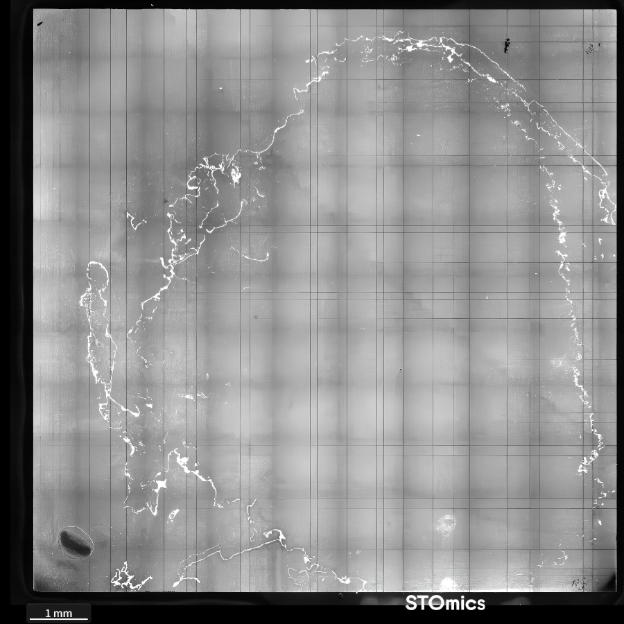
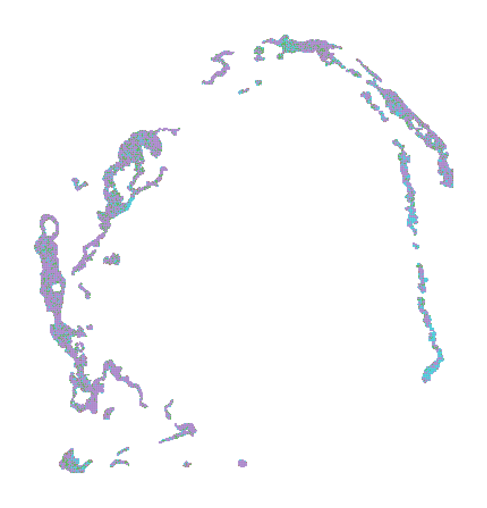
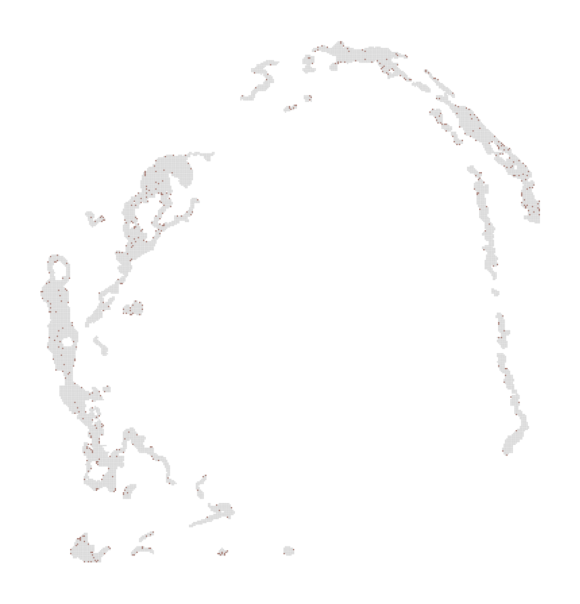
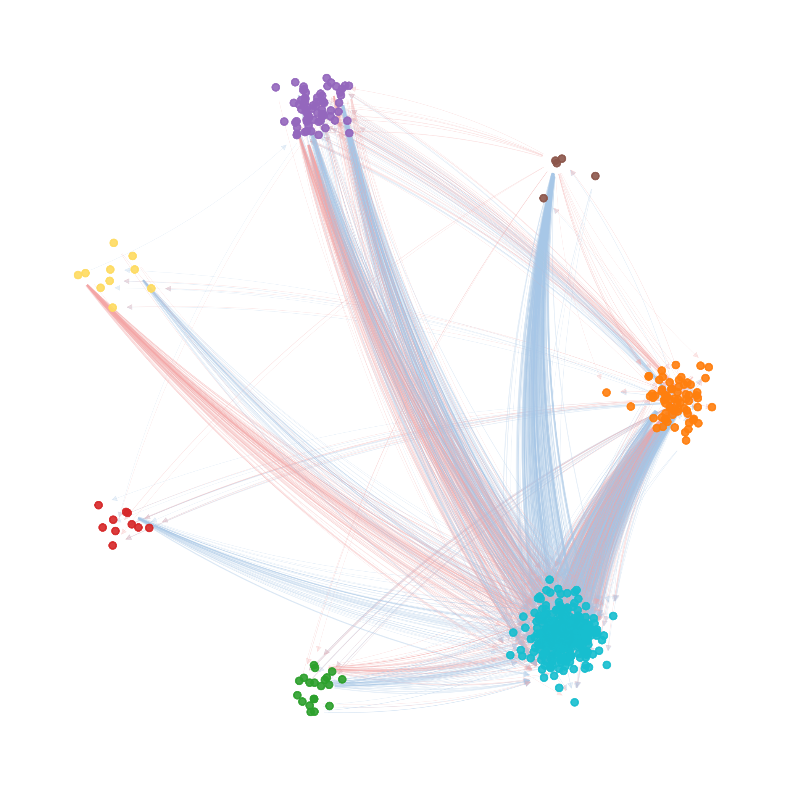

# 空间图谱、表达与细胞通讯

[返回结果总览](../README.md)。保留原文件名与全部格式，图号沿用原 Figures 编号（不同于代码编号）。

| 结果名称 | 文件格式 | 当前代码/笔记及证据 |
| --- | --- | --- |
| 43.Image.Auco_ST_ssDNA_image | [PNG](43.Image.Auco_ST_ssDNA_image.png) | [07.03_Scanpy_Auco_ST_Analysis_Python.ipynb](../../analysis/07_spatial_analysis/07.03_Scanpy_Auco_ST_Analysis_Python.ipynb)：主题关联，生成关系未核实 |
| 44.Image.Auco_ST_gene_exp_distribution | [PNG](44.Image.Auco_ST_gene_exp_distribution.png) | [07.03_Scanpy_Auco_ST_Analysis_Python.ipynb](../../analysis/07_spatial_analysis/07.03_Scanpy_Auco_ST_Analysis_Python.ipynb)：主题关联，生成关系未核实 |
| 45.VlnPlot.Auco_ST_statistics | [PDF](45.VlnPlot.Auco_ST_statistics.pdf) · [PNG](45.VlnPlot.Auco_ST_statistics.png) | [07.03_Scanpy_Auco_ST_Analysis_Python.ipynb](../../analysis/07_spatial_analysis/07.03_Scanpy_Auco_ST_Analysis_Python.ipynb)：文件名引用 |
| 46.Scatter.Auco_ST_black | [PDF](46.Scatter.Auco_ST_black.pdf) · [PNG](46.Scatter.Auco_ST_black.png) | [07.03_Scanpy_Auco_ST_Analysis_Python.ipynb](../../analysis/07_spatial_analysis/07.03_Scanpy_Auco_ST_Analysis_Python.ipynb)：文件名引用 |
| 47.Scatter.Auco_ST_white | [PDF](47.Scatter.Auco_ST_white.pdf) · [PNG](47.Scatter.Auco_ST_white.png) | [07.03_Scanpy_Auco_ST_Analysis_Python.ipynb](../../analysis/07_spatial_analysis/07.03_Scanpy_Auco_ST_Analysis_Python.ipynb)：文件名引用 |
| 48.Scatter.Auco_ST_Cnido_white | [PDF](48.Scatter.Auco_ST_Cnido_white.pdf) · [PNG](48.Scatter.Auco_ST_Cnido_white.png) | [07.03_Scanpy_Auco_ST_Analysis_Python.ipynb](../../analysis/07_spatial_analysis/07.03_Scanpy_Auco_ST_Analysis_Python.ipynb)：动态文件名/去编号对应 |
| 48.Scatter.Auco_ST_Epide_white | [PDF](48.Scatter.Auco_ST_Epide_white.pdf) · [PNG](48.Scatter.Auco_ST_Epide_white.png) | [07.03_Scanpy_Auco_ST_Analysis_Python.ipynb](../../analysis/07_spatial_analysis/07.03_Scanpy_Auco_ST_Analysis_Python.ipynb)：动态文件名/去编号对应 |
| 48.Scatter.Auco_ST_Neura_white | [PDF](48.Scatter.Auco_ST_Neura_white.pdf) · [PNG](48.Scatter.Auco_ST_Neura_white.png) | [07.03_Scanpy_Auco_ST_Analysis_Python.ipynb](../../analysis/07_spatial_analysis/07.03_Scanpy_Auco_ST_Analysis_Python.ipynb)：动态文件名/去编号对应 |
| 48.Scatter.Auco_ST_Senso_white | [PDF](48.Scatter.Auco_ST_Senso_white.pdf) · [PNG](48.Scatter.Auco_ST_Senso_white.png) | [07.03_Scanpy_Auco_ST_Analysis_Python.ipynb](../../analysis/07_spatial_analysis/07.03_Scanpy_Auco_ST_Analysis_Python.ipynb)：动态文件名/去编号对应 |
| 49.VlnPlot.Auco_ST_CN, C | [PDF](49.VlnPlot.Auco_ST_CN%2C%20C.pdf) | [07.03_Scanpy_Auco_ST_Analysis_Python.ipynb](../../analysis/07_spatial_analysis/07.03_Scanpy_Auco_ST_Analysis_Python.ipynb)：动态文件名/去编号对应 |
| 49.VlnPlot.Auco_ST_Epide | [PDF](49.VlnPlot.Auco_ST_Epide.pdf) | [07.03_Scanpy_Auco_ST_Analysis_Python.ipynb](../../analysis/07_spatial_analysis/07.03_Scanpy_Auco_ST_Analysis_Python.ipynb)：动态文件名/去编号对应 |
| 49.VlnPlot.Auco_ST_Neura | [PDF](49.VlnPlot.Auco_ST_Neura.pdf) | [07.03_Scanpy_Auco_ST_Analysis_Python.ipynb](../../analysis/07_spatial_analysis/07.03_Scanpy_Auco_ST_Analysis_Python.ipynb)：动态文件名/去编号对应 |
| 49.VlnPlot.Auco_ST_Senso | [PDF](49.VlnPlot.Auco_ST_Senso.pdf) | [07.03_Scanpy_Auco_ST_Analysis_Python.ipynb](../../analysis/07_spatial_analysis/07.03_Scanpy_Auco_ST_Analysis_Python.ipynb)：动态文件名/去编号对应 |
| 50.VlnPlot.Auco_SC_CN, C | [PDF](50.VlnPlot.Auco_SC_CN%2C%20C.pdf) | [07.03_Scanpy_Auco_ST_Analysis_Python.ipynb](../../analysis/07_spatial_analysis/07.03_Scanpy_Auco_ST_Analysis_Python.ipynb)：动态文件名/去编号对应 |
| 50.VlnPlot.Auco_SC_Epide | [PDF](50.VlnPlot.Auco_SC_Epide.pdf) | [07.03_Scanpy_Auco_ST_Analysis_Python.ipynb](../../analysis/07_spatial_analysis/07.03_Scanpy_Auco_ST_Analysis_Python.ipynb)：动态文件名/去编号对应 |
| 50.VlnPlot.Auco_SC_Neura | [PDF](50.VlnPlot.Auco_SC_Neura.pdf) | [07.03_Scanpy_Auco_ST_Analysis_Python.ipynb](../../analysis/07_spatial_analysis/07.03_Scanpy_Auco_ST_Analysis_Python.ipynb)：动态文件名/去编号对应 |
| 50.VlnPlot.Auco_SC_Senso | [PDF](50.VlnPlot.Auco_SC_Senso.pdf) | [07.03_Scanpy_Auco_ST_Analysis_Python.ipynb](../../analysis/07_spatial_analysis/07.03_Scanpy_Auco_ST_Analysis_Python.ipynb)：动态文件名/去编号对应 |
| 51.Echart_chord.Auco.ST_celltype_CCC | [HTML](51.Echart_chord.Auco.ST_celltype_CCC.html) · [SVG](51.Echart_chord.Auco.ST_celltype_CCC.svg) | [07.04_Scanpy_AureliaMarginST_MDIC3_Python.ipynb](../../analysis/07_spatial_analysis/07.04_Scanpy_AureliaMarginST_MDIC3_Python.ipynb)：主题关联，生成关系未核实 [51.Echart_chord.Auco.ST_celltype_CCC.txt](../../visualization/echarts_notes/51.Echart_chord.Auco.ST_celltype_CCC.txt)：手工绘图笔记 |
| 51.Heatmap.Auco.ST_celltype_CCC | [PDF](51.Heatmap.Auco.ST_celltype_CCC.pdf) | [07.04_Scanpy_AureliaMarginST_MDIC3_Python.ipynb](../../analysis/07_spatial_analysis/07.04_Scanpy_AureliaMarginST_MDIC3_Python.ipynb)：文件名引用 |
| 51.Network.Auco.ST_SpotSpotC | [PNG](51.Network.Auco.ST_SpotSpotC.png) | [07.04_Scanpy_AureliaMarginST_MDIC3_Python.ipynb](../../analysis/07_spatial_analysis/07.04_Scanpy_AureliaMarginST_MDIC3_Python.ipynb)：文件名引用 |
| 51.Network.Auco.ST_SpotSpotC_top5000 | [PNG](51.Network.Auco.ST_SpotSpotC_top5000.png) | [07.04_Scanpy_AureliaMarginST_MDIC3_Python.ipynb](../../analysis/07_spatial_analysis/07.04_Scanpy_AureliaMarginST_MDIC3_Python.ipynb)：文件名引用 |
| 52.Echart_chord.Auco.SC_celltype_CCC | [HTML](52.Echart_chord.Auco.SC_celltype_CCC.html) · [SVG](52.Echart_chord.Auco.SC_celltype_CCC.svg) | [07.05_Scanpy_AureliaSC_MDIC3_Python.ipynb](../../analysis/07_spatial_analysis/07.05_Scanpy_AureliaSC_MDIC3_Python.ipynb)：主题关联，生成关系未核实 [52.Echart_chord.Auco.SC_celltype_CCC.txt](../../visualization/echarts_notes/52.Echart_chord.Auco.SC_celltype_CCC.txt)：手工绘图笔记 |
| 52.Heatmap.Auco.SC_celltype_CCC | [PDF](52.Heatmap.Auco.SC_celltype_CCC.pdf) | [07.05_Scanpy_AureliaSC_MDIC3_Python.ipynb](../../analysis/07_spatial_analysis/07.05_Scanpy_AureliaSC_MDIC3_Python.ipynb)：文件名引用 |
| 52.Network.Auco.SC_CCC | [PNG](52.Network.Auco.SC_CCC.png) | [07.05_Scanpy_AureliaSC_MDIC3_Python.ipynb](../../analysis/07_spatial_analysis/07.05_Scanpy_AureliaSC_MDIC3_Python.ipynb)：文件名引用 |

## 使用说明

空间图像/平台导出；与空间流程相关，不作为 TACCO 计算输出的证明。

## 选图预览

预览使用原图，非重新计算或裁剪；其他格式见上表。

