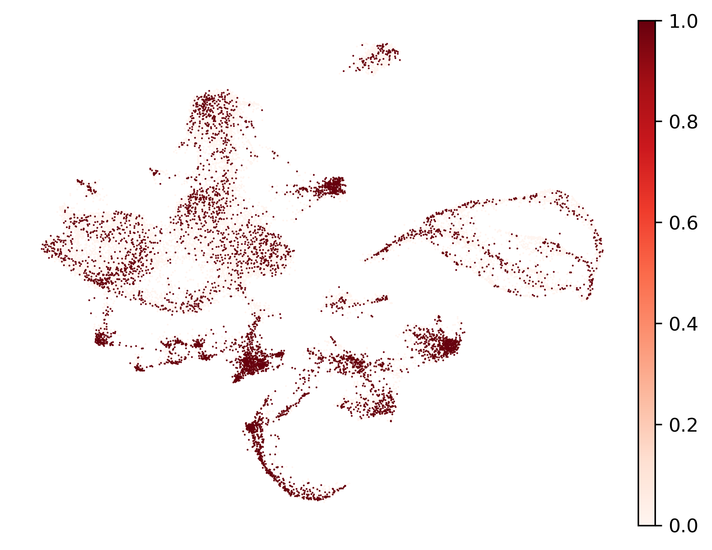
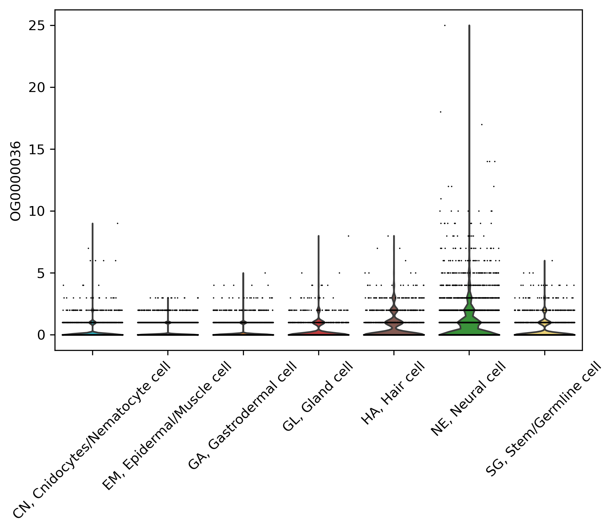
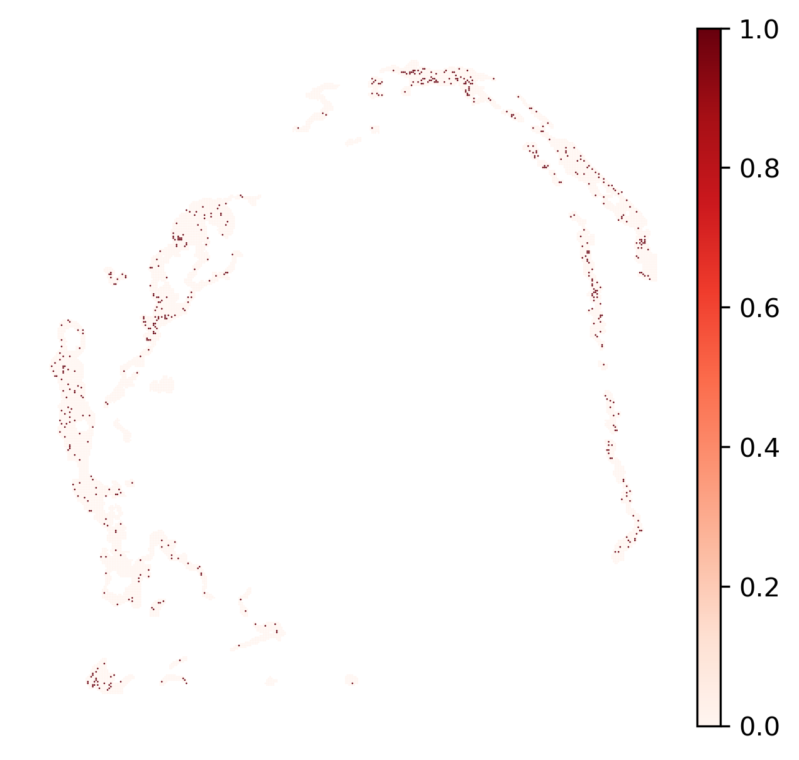
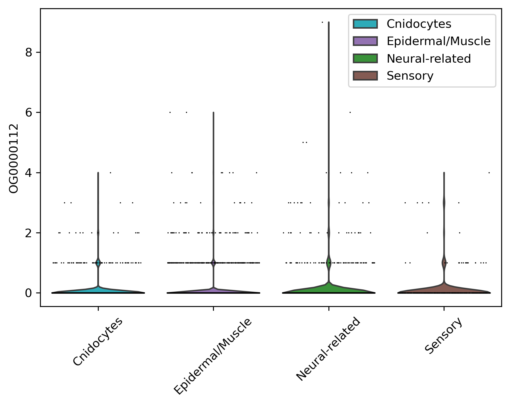

# 核心基因与网络

[返回结果总览](../README.md)。保留原文件名与全部格式，图号沿用原 Figures 编号（不同于代码编号）。

| 结果名称 | 文件格式 | 当前代码/笔记及证据 |
| --- | --- | --- |
| 75.jVenn_Hub_genes | [SVG](75.jVenn_Hub_genes.svg) | 未确认当前生成代码 |
| 76.string_vector_graphic | [SVG](76.string_vector_graphic.svg) | 未确认当前生成代码 |
| 76.string_vector_graphic_clustered | [SVG](76.string_vector_graphic_clustered.svg) | 未确认当前生成代码 |
| 77.DotPlot.HubGenes_enrichment_GO | [PDF](77.DotPlot.HubGenes_enrichment_GO.pdf) | 未确认当前生成代码 |
| 77.DotPlot.HubGenes_enrichment_KEGG | [PDF](77.DotPlot.HubGenes_enrichment_KEGG.pdf) | 未确认当前生成代码 |
| 78.sc_Hub_genes_umap_OG0000036 | [PNG](78.sc_Hub_genes_umap_OG0000036.png) | [08.01_Hub_gene_in_Auco_ST_Analysis_Python.ipynb](../../analysis/08_hub_genes/08.01_Hub_gene_in_Auco_ST_Analysis_Python.ipynb)：主题关联，生成关系未核实 |
| 78.sc_Hub_genes_umap_OG0000112 | [PNG](78.sc_Hub_genes_umap_OG0000112.png) | [08.01_Hub_gene_in_Auco_ST_Analysis_Python.ipynb](../../analysis/08_hub_genes/08.01_Hub_gene_in_Auco_ST_Analysis_Python.ipynb)：主题关联，生成关系未核实 |
| 78.sc_Hub_genes_violin_OG0000036 | [PNG](78.sc_Hub_genes_violin_OG0000036.png) | [08.01_Hub_gene_in_Auco_ST_Analysis_Python.ipynb](../../analysis/08_hub_genes/08.01_Hub_gene_in_Auco_ST_Analysis_Python.ipynb)：主题关联，生成关系未核实 |
| 78.sc_Hub_genes_violin_OG0000112 | [PNG](78.sc_Hub_genes_violin_OG0000112.png) | [08.01_Hub_gene_in_Auco_ST_Analysis_Python.ipynb](../../analysis/08_hub_genes/08.01_Hub_gene_in_Auco_ST_Analysis_Python.ipynb)：主题关联，生成关系未核实 |
| 78.st_Hub_genes_spatial_OG0000036 | [PNG](78.st_Hub_genes_spatial_OG0000036.png) | [08.01_Hub_gene_in_Auco_ST_Analysis_Python.ipynb](../../analysis/08_hub_genes/08.01_Hub_gene_in_Auco_ST_Analysis_Python.ipynb)：主题关联，生成关系未核实 |
| 78.st_Hub_genes_spatial_OG0000112 | [PNG](78.st_Hub_genes_spatial_OG0000112.png) | [08.01_Hub_gene_in_Auco_ST_Analysis_Python.ipynb](../../analysis/08_hub_genes/08.01_Hub_gene_in_Auco_ST_Analysis_Python.ipynb)：主题关联，生成关系未核实 |
| 78.st_Hub_genes_violin_OG0000036 | [PNG](78.st_Hub_genes_violin_OG0000036.png) | [08.01_Hub_gene_in_Auco_ST_Analysis_Python.ipynb](../../analysis/08_hub_genes/08.01_Hub_gene_in_Auco_ST_Analysis_Python.ipynb)：主题关联，生成关系未核实 |
| 78.st_Hub_genes_violin_OG0000112 | [PNG](78.st_Hub_genes_violin_OG0000112.png) | [08.01_Hub_gene_in_Auco_ST_Analysis_Python.ipynb](../../analysis/08_hub_genes/08.01_Hub_gene_in_Auco_ST_Analysis_Python.ipynb)：主题关联，生成关系未核实 |
| 80.CoreOG_Evolution_Trajectory_Pearson0.1 | [PDF](80.CoreOG_Evolution_Trajectory_Pearson0.1.pdf) | [08.02_Hub_genes_R.ipynb](../../analysis/08_hub_genes/08.02_Hub_genes_R.ipynb)：文件名引用 |

## 使用说明

Figures 文件有加编号、改名或动态文件名；关联代码可能写往 Data。未验证与 Data 中导出文件的字节相等。

已有核心基因相关结果（jVenn/STRING/富集）；尚未确认当前代码中的精确生成步骤。

## 选图预览

预览使用原图，非重新计算或裁剪；其他格式见上表。

