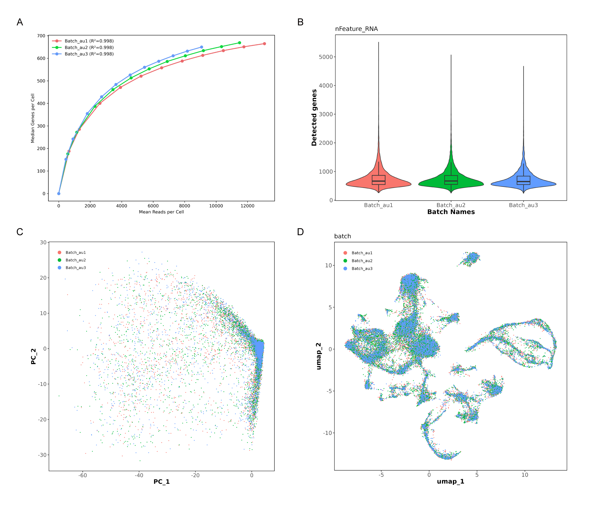
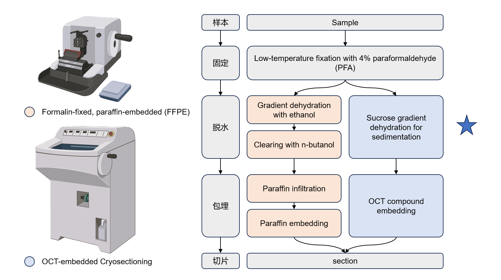
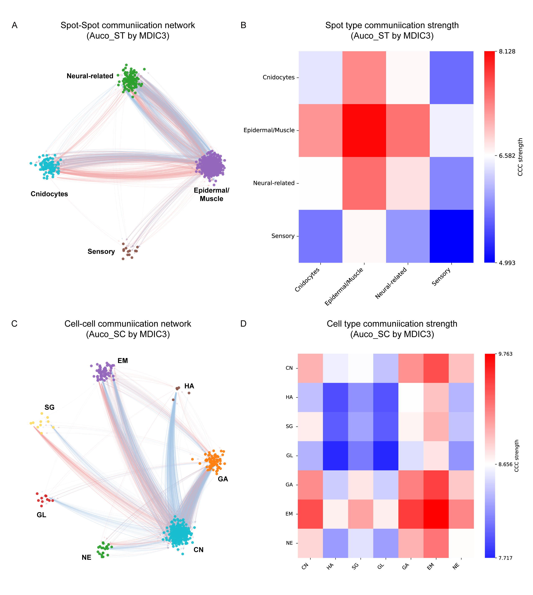
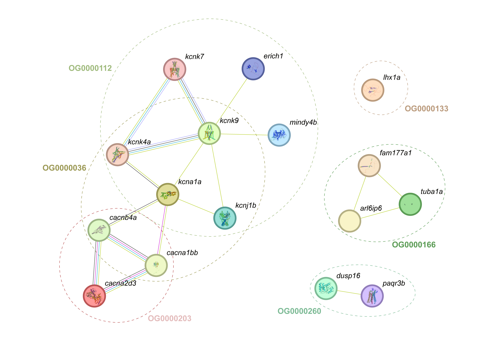

# 已有组图与图版

[返回结果总览](../README.md)。保留原文件名与全部格式，图号沿用原 Figures 编号（不同于代码编号）。

此目录保留 83 张已有图版。名称存在多套编号，未推断其先后版本，也未将同名序号映射为论文最终图。

| 结果名称 | 文件格式 | 当前代码/笔记及证据 |
| --- | --- | --- |
| 01 | [PNG](01.png) | 组图，逐面板对应未核实 |
| 02 | [PNG](02.png) | 组图，逐面板对应未核实 |
| 03 | [PNG](03.png) | 组图，逐面板对应未核实 |
| 04 | [PNG](04.png) | 组图，逐面板对应未核实 |
| 05 | [PNG](05.png) | 组图，逐面板对应未核实 |
| 06 | [PNG](06.png) | 组图，逐面板对应未核实 |
| 07 | [PNG](07.png) | 组图，逐面板对应未核实 |
| 08 | [PNG](08.png) | 组图，逐面板对应未核实 |
| 09 | [PNG](09.png) | 组图，逐面板对应未核实 |
| 1-01 | [PNG](1-01.png) | 组图，逐面板对应未核实 |
| 1-02 | [PNG](1-02.png) | 组图，逐面板对应未核实 |
| 1-03 | [PNG](1-03.png) | 组图，逐面板对应未核实 |
| 1-04 | [PNG](1-04.png) | 组图，逐面板对应未核实 |
| 1-05 | [PNG](1-05.png) | 组图，逐面板对应未核实 |
| 1-06 | [PNG](1-06.png) | 组图，逐面板对应未核实 |
| 10 | [PNG](10.png) | 组图，逐面板对应未核实 |
| 11 | [PNG](11.png) | 组图，逐面板对应未核实 |
| 12 | [PNG](12.png) | 组图，逐面板对应未核实 |
| 13 | [PNG](13.png) | 组图，逐面板对应未核实 |
| 14 | [PNG](14.png) | 组图，逐面板对应未核实 |
| 15 | [PNG](15.png) | 组图，逐面板对应未核实 |
| 16-02 | [PNG](16-02.png) | 组图，逐面板对应未核实 |
| 16_01 | [PNG](16_01.png) | 组图，逐面板对应未核实 |
| 16_02 | [PNG](16_02.png) | 组图，逐面板对应未核实 |
| 17 | [PNG](17.png) | 组图，逐面板对应未核实 |
| 18 | [PNG](18.png) | 组图，逐面板对应未核实 |
| 19 | [PNG](19.png) | 组图，逐面板对应未核实 |
| 2-01 | [PNG](2-01.png) | 组图，逐面板对应未核实 |
| 2-03 | [PNG](2-03.png) | 组图，逐面板对应未核实 |
| 2-04 | [PNG](2-04.png) | 组图，逐面板对应未核实 |
| 2-05 | [PNG](2-05.png) | 组图，逐面板对应未核实 |
| 2-06 | [PNG](2-06.png) | 组图，逐面板对应未核实 |
| 2-07 | [PNG](2-07.png) | 组图，逐面板对应未核实 |
| 2-08 | [PNG](2-08.png) | 组图，逐面板对应未核实 |
| 2-09 | [PNG](2-09.png) | 组图，逐面板对应未核实 |
| 20_01 | [PNG](20_01.png) | 组图，逐面板对应未核实 |
| 20_02 | [PNG](20_02.png) | 组图，逐面板对应未核实 |
| 21_01 | [PNG](21_01.png) | 组图，逐面板对应未核实 |
| 21_02 | [PNG](21_02.png) | 组图，逐面板对应未核实 |
| 22_01 | [PNG](22_01.png) | 组图，逐面板对应未核实 |
| 22_02 | [PNG](22_02.png) | 组图，逐面板对应未核实 |
| 3-06 | [PNG](3-06.png) | 组图，逐面板对应未核实 |
| 3-07 | [PNG](3-07.png) | 组图，逐面板对应未核实 |
| 3-08 | [PNG](3-08.png) | 组图，逐面板对应未核实 |
| 3-09 | [PNG](3-09.png) | 组图，逐面板对应未核实 |
| 3-10 | [PNG](3-10.png) | 组图，逐面板对应未核实 |
| 3-11 | [PNG](3-11.png) | 组图，逐面板对应未核实 |
| 3-12 | [PNG](3-12.png) | 组图，逐面板对应未核实 |
| 3-13 | [PNG](3-13.png) | 组图，逐面板对应未核实 |
| 3-14 | [PNG](3-14.png) | 组图，逐面板对应未核实 |
| 3-15 | [PNG](3-15.png) | 组图，逐面板对应未核实 |
| 3-16 | [PNG](3-16.png) | 组图，逐面板对应未核实 |
| 3-17 | [PNG](3-17.png) | 组图，逐面板对应未核实 |
| 3-18 | [PNG](3-18.png) | 组图，逐面板对应未核实 |
| 3-19 | [PNG](3-19.png) | 组图，逐面板对应未核实 |
| 3-20 | [PNG](3-20.png) | 组图，逐面板对应未核实 |
| 4-01 | [PNG](4-01.png) | 组图，逐面板对应未核实 |
| 4-02 | [JPG](4-02.jpg) | 组图，逐面板对应未核实 |
| 4-03 | [PNG](4-03.png) | 组图，逐面板对应未核实 |
| 4-04 | [PNG](4-04.png) | 组图，逐面板对应未核实 |
| 4-05 | [PNG](4-05.png) | 组图，逐面板对应未核实 |
| 4-06 | [PNG](4-06.png) | 组图，逐面板对应未核实 |
| 4-07 | [PNG](4-07.png) | 组图，逐面板对应未核实 |
| 4-08 | [PNG](4-08.png) | 组图，逐面板对应未核实 |
| 4-09 | [PNG](4-09.png) | 组图，逐面板对应未核实 |
| 4-10 | [PNG](4-10.png) | 组图，逐面板对应未核实 |
| 4-11 | [PNG](4-11.png) | 组图，逐面板对应未核实 |
| 4-12 | [PNG](4-12.png) | 组图，逐面板对应未核实 |
| 4-13 | [PNG](4-13.png) | 组图，逐面板对应未核实 |
| 4-14 | [PNG](4-14.png) | 组图，逐面板对应未核实 |
| 4-15 | [PNG](4-15.png) | 组图，逐面板对应未核实 |
| 5-03 | [PNG](5-03.png) | 组图，逐面板对应未核实 |
| 5-04 | [PNG](5-04.png) | 组图，逐面板对应未核实 |
| 5-05 | [PNG](5-05.png) | 组图，逐面板对应未核实 |
| 5-06 | [PNG](5-06.png) | 组图，逐面板对应未核实 |
| 5-07 | [PNG](5-07.png) | 组图，逐面板对应未核实 |
| 5-08 | [PNG](5-08.png) | 组图，逐面板对应未核实 |
| 5-09 | [PNG](5-09.png) | 组图，逐面板对应未核实 |
| 5-10 | [PNG](5-10.png) | 组图，逐面板对应未核实 |
| 5-11 | [PNG](5-11.png) | 组图，逐面板对应未核实 |
| 5-12 | [PNG](5-12.png) | 组图，逐面板对应未核实 |
| 5-13 | [PNG](5-13.png) | 组图，逐面板对应未核实 |
| 5-14 | [PNG](5-14.png) | 组图，逐面板对应未核实 |

## 使用说明

保留已有图版；未确定稿件版本及逐面板代码映射，不将其命名为论文最终图。

## 选图预览

预览使用原图，非重新计算或裁剪；其他格式见上表。

