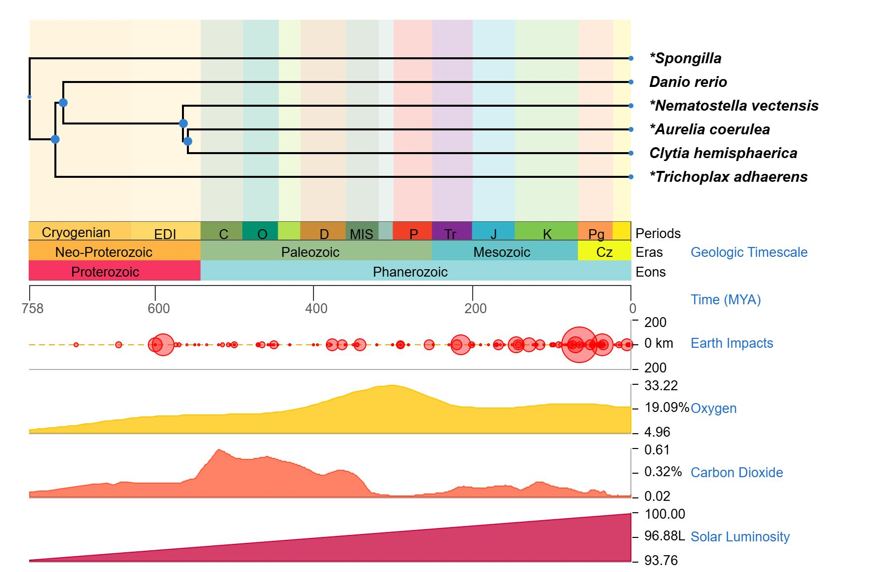
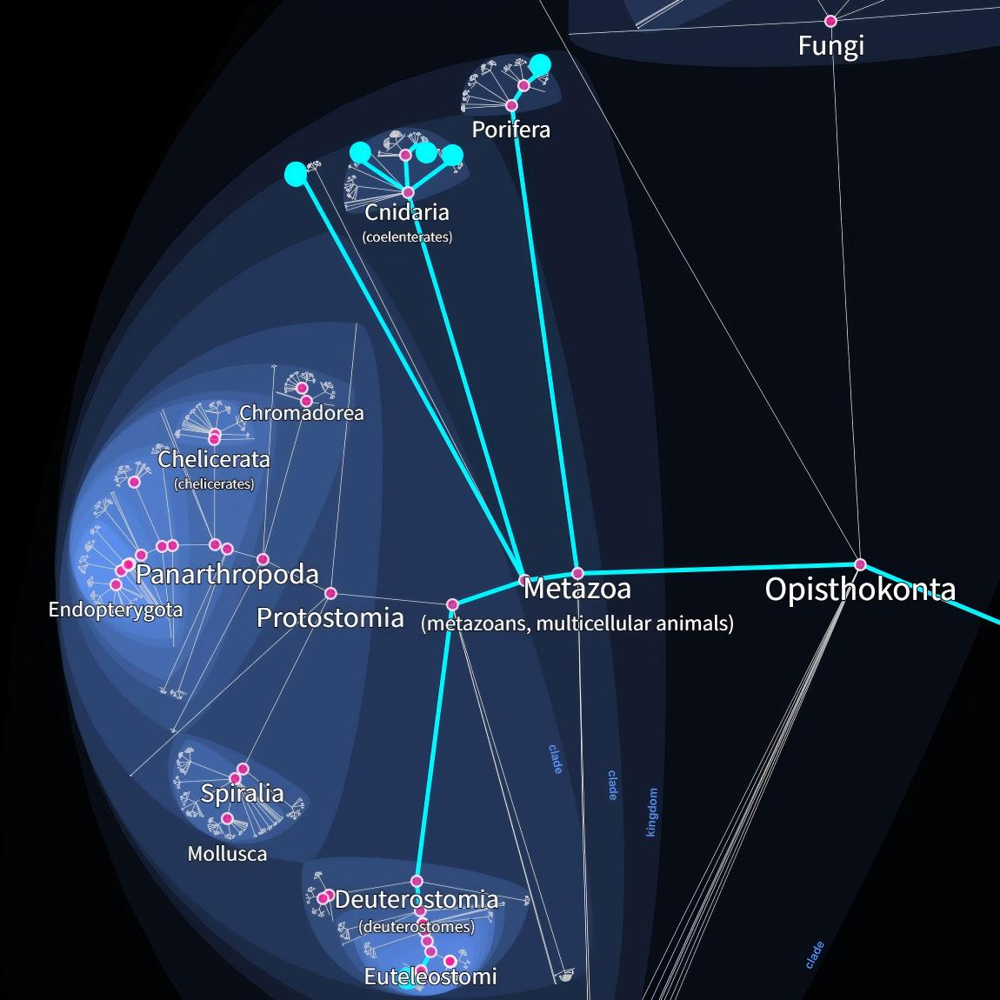

# 组织图像与系统发育背景资料

[返回结果总览](../README.md)。保留原文件名与全部格式，图号沿用原 Figures 编号（不同于代码编号）。

| 结果名称 | 文件格式 | 当前代码/笔记及证据 |
| --- | --- | --- |
| 53.H&E.Aco47 | [PNG](53.H%26E.Aco47.png) | 未确认当前生成代码 |
| 54.Timetree.Species | [JPG](54.Timetree.Species.jpg) · [SVG](54.Timetree.Species.svg) | 未确认当前生成代码 |
| 55.MetazoaEvoTree | [SVG](55.MetazoaEvoTree.svg) | 未确认当前生成代码 |
| 56.Lifemap | [JPG](56.Lifemap.jpg) | 未确认当前生成代码 |
| 57.iTOL_Rectangular | [SVG](57.iTOL_Rectangular.svg) | 未确认当前生成代码 |
| 57.iTOL_circular | [SVG](57.iTOL_circular.svg) | 未确认当前生成代码 |

## 使用说明

组织/系统发育背景或外部工具图；未找到当前仓库中的精确生成代码。

## 选图预览

预览使用原图，非重新计算或裁剪；其他格式见上表。

